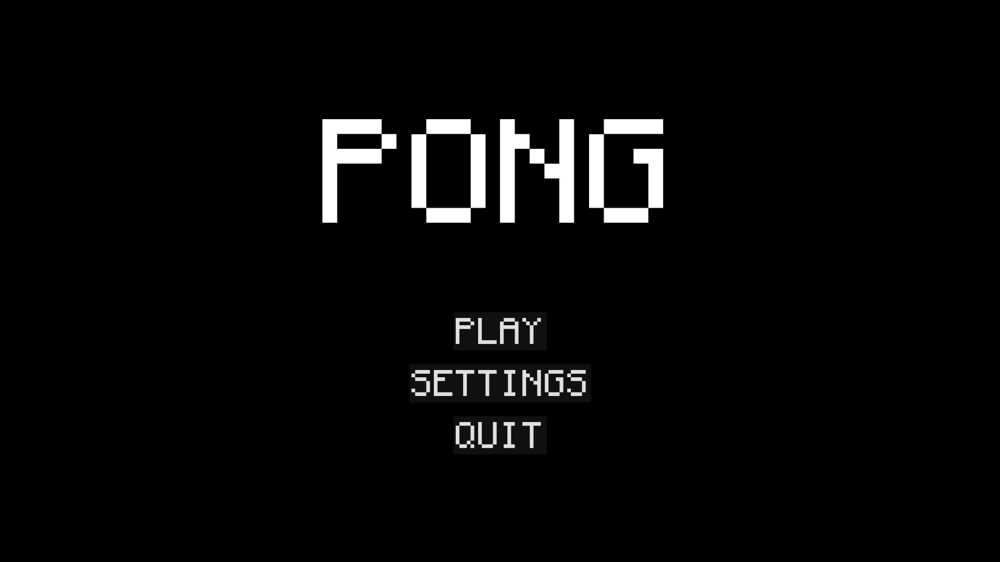
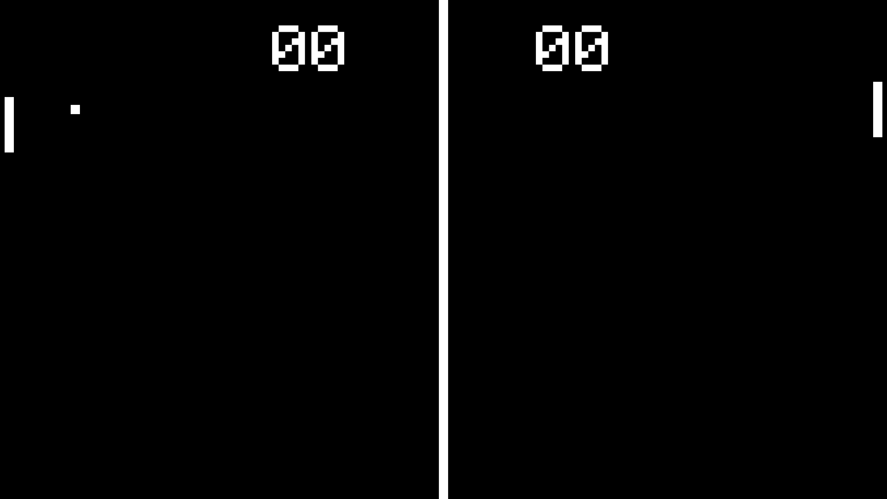
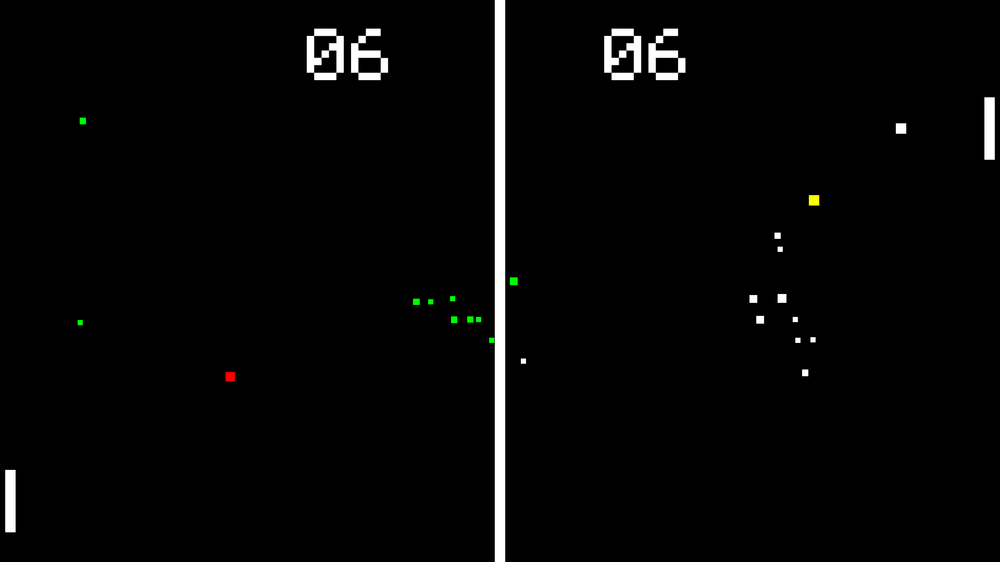
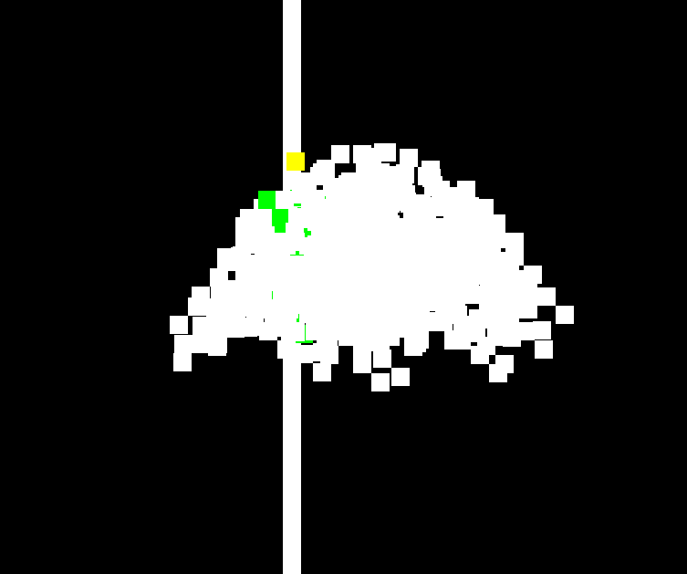
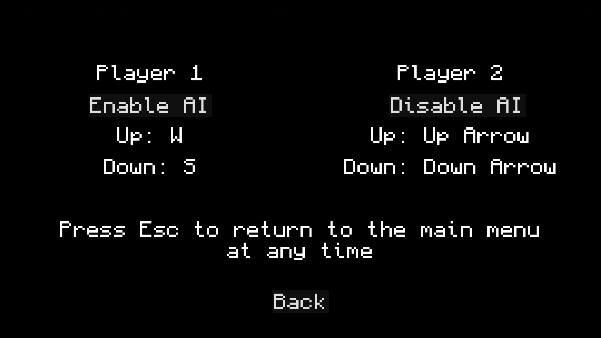

# Pong!

Just completely normal pong. I promise. There's nothing weird about it. Seriously.

You can download it [here](https://github.com/MusicalArtist12/cs383-pong/releases), or play it without downloading [here](https://pong.juliaviolet.dev/)

### SPOILERS

This isn't normal pong. On the 4th time a ball passes through the center line, it splits into two. Oh, and if two collide, they both break up into two each.

The balls change color as they pass through the center line. White -> Green -> Yellow -> Red.

*(This. This Is what happens if `MAX_SPLITS` is too large)*

## Controls
|  | Player 1 | Player 2 |
| --- | --- | --- |
| Up | W | Up Arrow | 
| Down | S | Down Arrow | 
| Exit | ESC | ESC | 

V1.0 does not allow for these controls to be changed in game. 

Enable or Disable AI for either side by toggling `Enable AI` or `Disable AI`

## Credits
- **Julia Abdel-Monem**
- *Created For CS383 @ University of Idaho*
- Created using Godot using GDScript
- [Monocraft](https://github.com/IdreesInc/Monocraft) Font - [idreesinc.com](https://idreesinc.com)
- [Beginner Godot Tutorial - How to Make Pong with AI | Coding With Russ](https://www.youtube.com/watch?v=Xq9AyhX8HUc) A great Godot beginner tutorial. Probably around 30% of the code came from here. 
